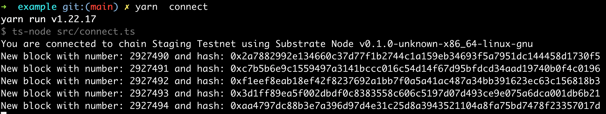
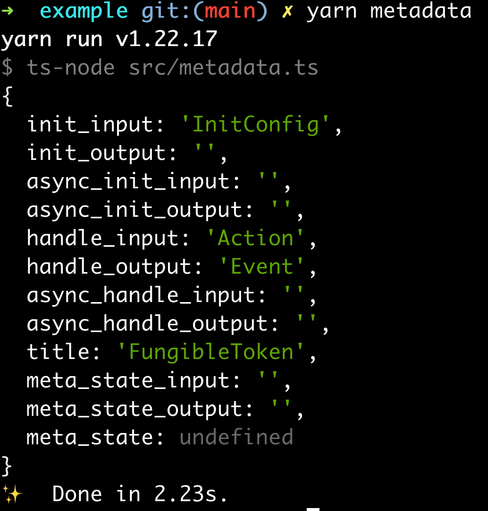
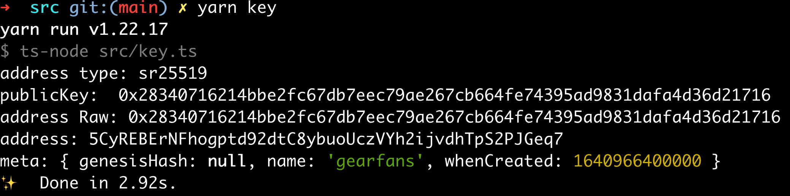
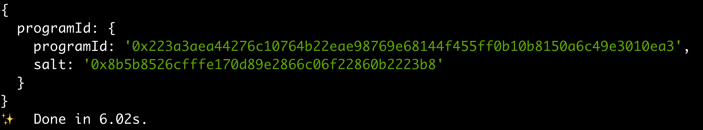

# 介绍

gear-js 是 Gear 的 js sdk，通过这个工具我们可以连接节点，上传合约，发送交易，还有解析 Gear 合约等。

# 如何使用 gear js sdk

## 如何安装

```shell
npm install @gear-js/api
或者
yarn add @gear-js/api
```

## 开始

```js
import { GearApi } from '@gear-js/api'
```

## 例子

### 连接到指定的 rpc 节点

```js
const rpc = "wss://rpc-node.gear-tech.io"

const gearApi = await GearApi.create({
  providerAddress: rpc
})
```

```js
// 获取节点信息
const [chain, nodeName, nodeVersion] = await Promise.all([
  gearApi.chain(),
  gearApi.nodeName(),
  gearApi.nodeVersion(),
]);

console.log(`You are connected to chain ${chain} using ${nodeName} v${nodeVersion}`);

// 获取最新块信息

await gearApi.gearEvents.subscribeToNewBlocks((header) => {
  console.log(`New block with number: ${header.number.toNumber()} and hash: ${header.hash.toHex()}`);
});
```

具体代码请参考：https://github.com/GearFans/example/blob/main/src/connect.ts

> 

### 获取 wasm 合约的元数据

```js
import { getWasmMetadata } from '@gear-js/api';
const fileBuffer = fs.readFileSync('path/to/program.meta.wasm');
const meta = await getWasmMetadata(fileBuffer);
```

具体代码请参考： https://github.com/GearFans/example/blob/main/src/metadata.ts

> 

### 创建 keyring

```js
// 创建一个新的 keyring
const { keyring, json } = await GearKeyring.create('keyringName')

// 从 JSON 文件得到 keyring
const jsonKeyring = fs.readFileSync('path/to/keyring.json').toString()
const keyring = GearKeyring.fromJson(jsonKeyring)
```

具体代码请参考： https://github.com/GearFans/example/blob/main/src/key.ts

> 

### 上传程序

```js
const code = fs.readFileSync('path/to/program.wasm');

const uploadProgram = {
  code,
  gasLimit: 1000000,
  value: 1000,
  initPayload: somePayload
};

const programId = await gearApi.program.submit(uploadProgram, meta);

await gearApi.program.signAndSend(keyring, (data) => {
  console.log(data);
});
```

具体代码请参考：https://github.com/GearFans/example/blob/main/src/upload.ts

> 

### 发送消息

```js
const message = {
  destination: programId, // programId
  payload: somePayload,
  gasLimit: 10000000,
  value: 0
}

await gearApi.message.submit(message, meta)

await gearApi.message.signAndSend(keyring, (data) => {
  console.log(data)
})

```

具体代码请参考：https://github.com/GearFans/example/blob/main/src/mint.ts

https://github.com/GearFans/example/blob/main/src/balanceof.ts

这 2 个例子是 erc20 的 mint，以及获取 balance。

### 获取事件

发送完事件后，我们要接受事件。

```js
const rpc = "wss://rpc-node.gear-tech.io"

const gearApi = await GearApi.create({
  providerAddress: rpc
})

gearApi.allEvents((events) => {
  events.forEach(async ({
    event: { data, method }
  }) => {})

})
```

具体代码请参考：https://github.com/GearFans/example/blob/main/src/event.ts

> 
